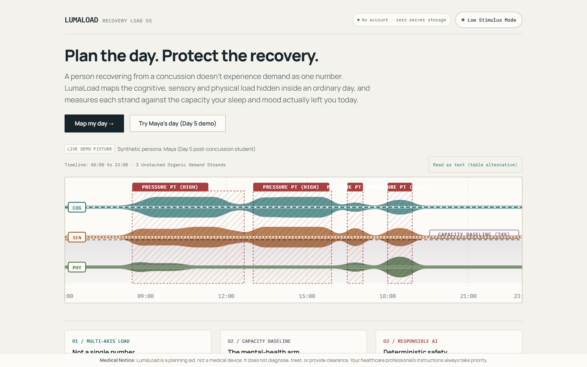
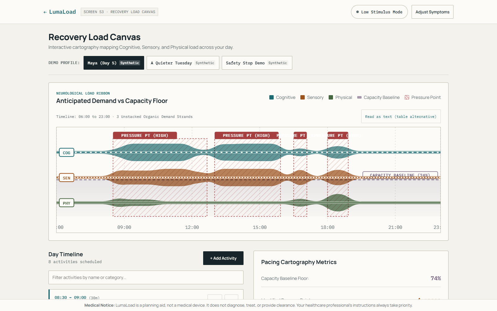
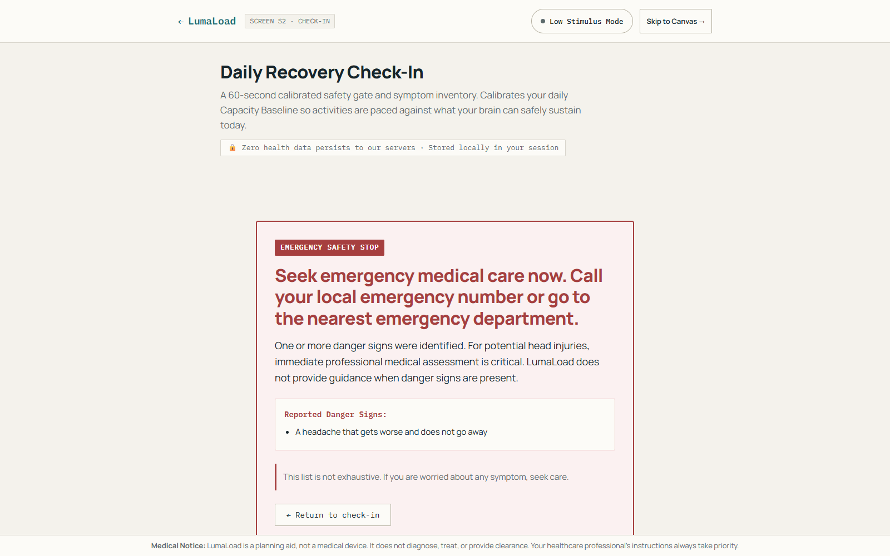
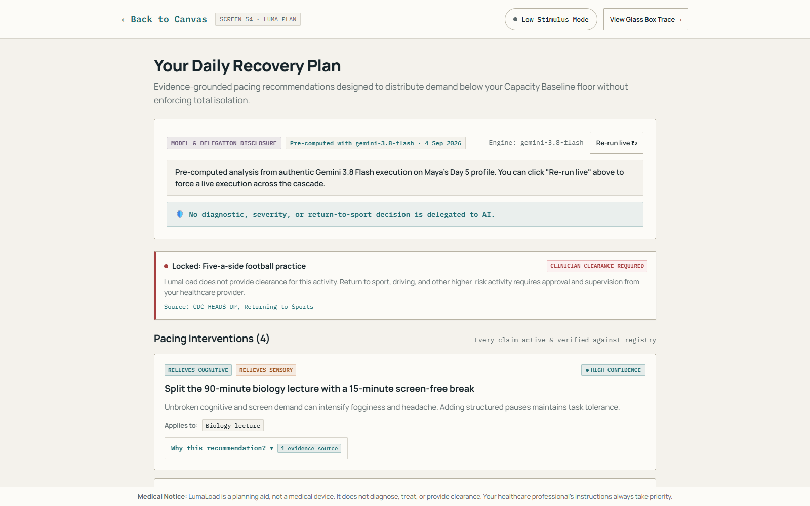
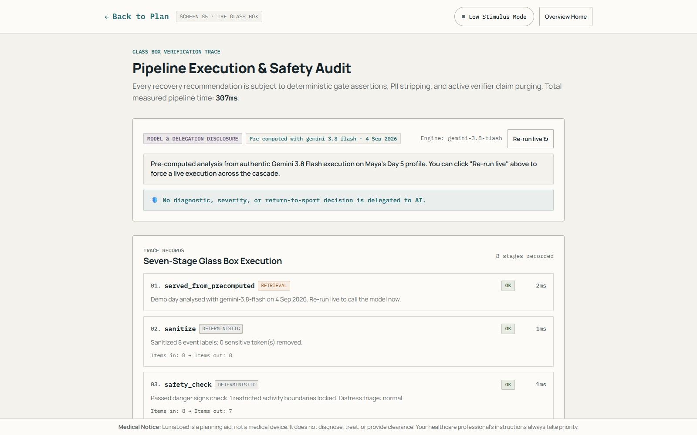
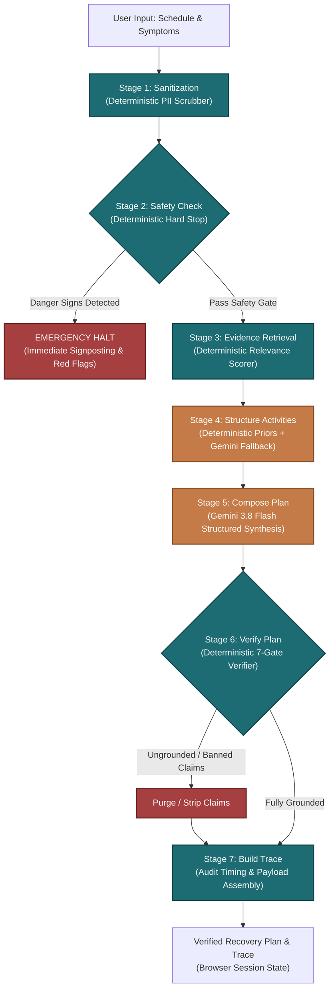

# LumaLoad — Recovery Load OS

> **Plan the day. Protect the recovery.**  
> Evidence-grounded neurological demand cartography for concussion recovery.  
> Solo hackathon entry for *Hack for Humanity | Summer 2026* (Devpost submission).

**Live Production Deployment:** [https://lumaload.vercel.app](https://lumaload.vercel.app)  
**GitHub Repository:** [https://github.com/AtchayamG/lumaload](https://github.com/AtchayamG/lumaload)

---

## What is LumaLoad?

A person recovering from a concussion doesn't experience demand as a single number—an hour writing in a quiet room is fundamentally different from an hour navigating a crowded cafeteria. LumaLoad is an evidence-grounded neurological demand cartography platform that maps the cognitive, sensory, and physical load hidden inside an ordinary day, measuring each strand against your personalized daily capacity baseline to prevent symptom spikes.

---

## How It Works

1. **Check-In (`/check-in`):** Complete an initial clinical safety gate and rate 8 calibrated symptom domains (0–10) alongside sleep and mood to establish your physiological Capacity Baseline floor.
2. **Canvas (`/canvas`):** Schedule daily events or load precomputed recovery personas; interactive modal controls allow adding, editing, and categorizing activities with 7 environmental demand modifiers (screens, noise, crowds).
3. **Load Ribbon & Capacity Baseline:** A custom SVG Neurological Load Ribbon plots continuous Cognitive, Sensory, and Physical demands against your Capacity Floor, highlighting pressure points before crashes occur.
4. **Glass Box Pipeline (`/api/analyze-day`):** A transparent 7-stage deterministic + Gemini AI pipeline scrubs PII, queries verified clinical evidence, assesses demands, and synthesizes tailored pacing interventions.
5. **Plan (`/plan`):** Receive up to 5 prioritized, evidence-cited pacing modifications, micro-break insertions, and clinician boundaries designed to protect recovery without enforcing total isolation.
6. **The Glass Box (`/trace`):** Inspect the full execution audit log with stage-by-stage millisecond timings, model disclosures, active verifier purges, sanitized payloads, and static evidence citations.

---

## Interface Tour & Screenshots

| Screen S1 · Story (`/`) | Screen S3 · Recovery Canvas (`/canvas`) |
|---|---|
|  |  |
| *Neurological Load Cartography thesis & interactive hero ribbon.* | *24h timeline, interactive EventEditor & 3-strand Load Ribbon.* |

| Screen S2 · Clinical Hard Stop (`/check-in`) | Screen S4 · The Luma Plan (`/plan`) |
|---|---|
|  |  |
| *Deterministic CDC danger-sign halt before any model runs.* | *Evidence-grounded accommodations with live "Why?" drawers.* |

### Screen S5 · The Glass Box Audit (`/trace`)

*Complete algorithmic audit: exact millisecond durations, PII scrubber, model disclosures, and active verifier claim purges.*

---

## Architecture Diagram

The 7-stage Glass Box execution pipeline decouples safety assertions and evidence verification from model inference:



---

## The Safety Model

LumaLoad operates under a strict three-tier deterministic safety architecture designed for high-stakes health contexts:

- **Deterministic danger-sign hard stop that never reaches a model:** 8 CDC red-flag danger signs (unequal pupils, worsening headache, repeated vomiting, slurred speech, seizures, numbness, increased confusion) are evaluated by deterministic code, immediately halting all downstream processing and rendering emergency clinical guidance without ever invoking an LLM.
- **Restricted activities never rescheduled or cleared:** High-risk activities involving collision, fall risk, or high-speed navigation (e.g., contact sports, driving) are locked under clinician boundary rules and cannot be scheduled, shifted, or cleared by the model.
- **Every recommendation requires a registry evidence ID or the verifier deletes it:** Every model recommendation must cite an immutable evidence ID from our static clinical registry (`src/data/evidence.json`); an independent verifier cross-checks each claim against the cited text, enforcing allowed-use boundaries and purging ungrounded or hallucinated assertions before rendering.

---

## Responsible AI & Privacy

- **Deterministic vs. Model-Generated:**
  - *Deterministic Stages:* PII scrubbing, 8 CDC danger signs detection, clinician boundary locks, Capacity Baseline calculation, heuristic load scoring, evidence retrieval ranking, and active verifier claim purging.
  - *Model-Generated Stages:* Structured demand vector classification for novel/unmapped activities (Gemini 3.8 Flash) and evidence-grounded pacing recommendation synthesis.
- **PII Sanitisation:** Deterministic regex and pattern scrubbers strip patient names, email addresses, phone numbers, external URLs, and long digit sequences before any payload reaches an AI stage.
- **Zero Server-Side Health Persistence:** All patient symptoms, context, and schedules are stored exclusively in client-side memory and local session storage (`sessionStorage`/`localStorage`). No patient health information (PHI) is ever saved to a database, external log, or remote analytics server.
- **Honest Degraded Labelling:** If Gemini quota is exhausted or rate limits are reached, the system immediately cascades to LumaLoad's deterministic offline rules engine in ~150ms, clearly surfacing the verbatim disclosure:
  > *"Model quota exhausted on the free tier. This plan was produced by LumaLoad's deterministic rules engine. The evidence, safety gates and boundaries below are unaffected — they never depend on a model."*
- **Pre-computed Demo Disclosure:** Synthetic clinical personas (Maya Day 5, A Quieter Tuesday, Danger Sign Demo) are precomputed with `gemini-3.8-flash` and served from cache with transparent badges and a "Re-run live" trigger button for instant auditing without consuming judge quota.

---

## Curated Evidence Sources & Attribution

All clinical and recovery guidelines in LumaLoad's evidence registry (`src/data/evidence.json`) are grounded in verified, reputable, publicly accessible institutional guidance:

1. **Centers for Disease Control and Prevention (CDC) — Symptoms of Mild TBI and Concussion**  
   *Organization:* Centers for Disease Control and Prevention  
   *Official URL:* [https://www.cdc.gov/traumatic-brain-injury/signs-symptoms/index.html](https://www.cdc.gov/traumatic-brain-injury/signs-symptoms/index.html)
2. **Centers for Disease Control and Prevention (CDC) — Recovering From a Mild TBI or Concussion**  
   *Organization:* Centers for Disease Control and Prevention  
   *Official URL:* [https://www.cdc.gov/traumatic-brain-injury/response/index.html](https://www.cdc.gov/traumatic-brain-injury/response/index.html)
3. **CDC HEADS UP — Returning to School After a Concussion**  
   *Organization:* CDC HEADS UP Initiative  
   *Official URL:* [https://www.cdc.gov/heads-up/guidelines/returning-to-school.html](https://www.cdc.gov/heads-up/guidelines/returning-to-school.html)
4. **CDC HEADS UP — Returning to Sports After a Concussion**  
   *Organization:* CDC HEADS UP Initiative  
   *Official URL:* [https://www.cdc.gov/heads-up/guidelines/returning-to-sports.html](https://www.cdc.gov/heads-up/guidelines/returning-to-sports.html)
5. **British Journal of Sports Medicine (BJSM) — Amsterdam 2022 Consensus Statement on Concussion in Sport**  
   *Citation:* Patricios JS, Schneider GM, Dvorak J, et al. Consensus statement on concussion in sport: the 6th International Conference on Concussion in Sport—Amsterdam, October 2022. *British Journal of Sports Medicine* 2023;57:695-711.  
   *Official URL:* [https://bjsm.bmj.com/content/57/11/695](https://bjsm.bmj.com/content/57/11/695)
6. **Concussion Alliance — Concussion Recovery Guide**  
   *Organization:* Concussion Alliance  
   *Official URL:* [https://www.concussionalliance.org/recovery-guide](https://www.concussionalliance.org/recovery-guide)

---

## Medical Notice

**LumaLoad is a daily planning aid, not a medical device.** It does not diagnose, treat, prevent, or cure any medical condition, nor does it provide clinical return-to-learn, return-to-work, or return-to-play clearance. Healthcare professional instructions always take absolute precedence over any suggestion generated by this software.

---

## Local Setup & Development

### Prerequisites
- Node.js 18+ (tested on Node 20 / 24)
- npm or yarn

### Installation
```bash
# 1. Clone repository
git clone https://github.com/AtchayamG/lumaload.git
cd lumaload

# 2. Install dependencies
npm install

# 3. Configure environment variables (.env.local)
# GEMINI_API_KEY is optional for demo browsing; required for live model analysis
echo "GEMINI_API_KEY=your_gemini_api_key_here" > .env.local

# 4. Start development server
npm run dev
```
Open [http://localhost:3000](http://localhost:3000) to view LumaLoad.

### Running Tests & Verification
```bash
# Run unit and integration tests (39 tests across 7 test suites)
npm test

# Run TypeScript strict typecheck
npm run typecheck

# Build for production
npm run build

# Run automated Puppeteer live verification suite against deployment
npx tsx scripts/verify-live.ts
```

---

## License

MIT License. Developed solo by Atchayam G for *Hack for Humanity | Summer 2026*.